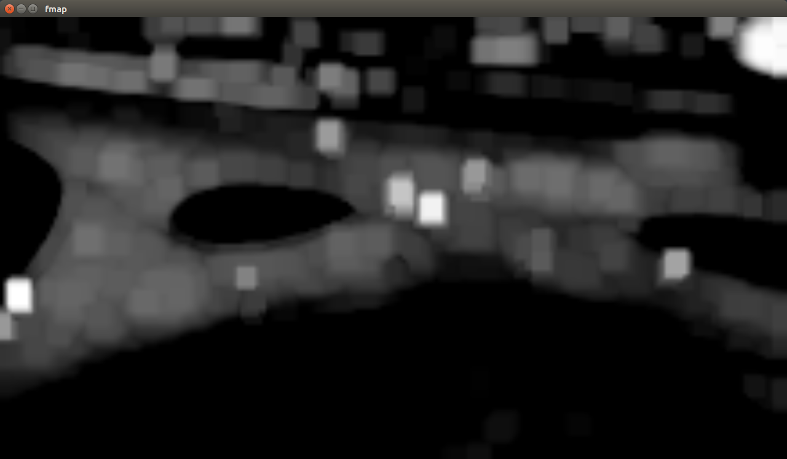

Deep Features
=============

Abstract of the project report, found [here](report/report.pdf).

> Almost all vision-based algorithms (deep learning and otherwise) rely on finding a set of lower dimensional features from a higher dimensional image space. In the visual tracking problem, salient features of the target(s) being tracked are selected using one of a variety of feature detector algorithms. Features are then corresponded across video frames and those measurements are passed to a filtering and data association stage. The bottleneck of most target trackers is the vision based frontend. The purpose of this work is to consider the computational efficiency and tracking accuracy of a convolutional network based approach.

The answer to this question is still somewhat unresolved -- I think more work could be done to help answer this question. However, the results of this project seem to indicate that the traditional Good Features to Track algorithm with LK Optical Flow perform about 2x faster (~14fps) than the deep featuers approach.

-------------------

## Setup ##

1. Create a Python 2.7 `virtualenv`.
1. Install OpenCV 2.4.13 (See [here](https://github.com/plusk01/tests/tree/master/opencv_multiple_versions) for info on side-by-side installations).
1. Install requirements: `pip install -r requirements.txt`
1. Run: `ipython main.py`

## Principle of Operation ##

This is a visual multiple target tracking framework for comparing the computational efficiency and accuracy of using the lower levels of a ConvNet (`VGG16`) for feature extraction, as opposed to a more traditional algorithm such as Good Features to Track.

In order to switch the method of feature extraction, change the line in `main.py` to pass in a Boolean flag for whether or not to use deep features:

```python
findMeas = FindMeasurements(deep=True)
```

You can also change the layer/filter of `VGG16` that is used for feature extraction in `findmeasurements/DeepFeatures`:

```python
# Which VGG layer to steal activations from?
self.feature_layer = self.vgg.conv1_2

# Which filter output of the feature_layer to use?
self.feature_map = 45
```

Feature maps are also saved and can be viewed in the `fmaps/*` folder.

## Getting the data ##

Two data files are needed to run this project:

- Weights for Oxford's Visual Geometry Group (`VGG16`) architecture, which can be found [here](https://www.cs.toronto.edu/~frossard/post/vgg16/) from Davi Frossard.
- The first 30 seconds of the `campus.mp4` recording of multiple moving targets that can be found [here](https://github.com/plusk01/deep-features/wiki/campus.mp4).

## Example Feature Map ##


